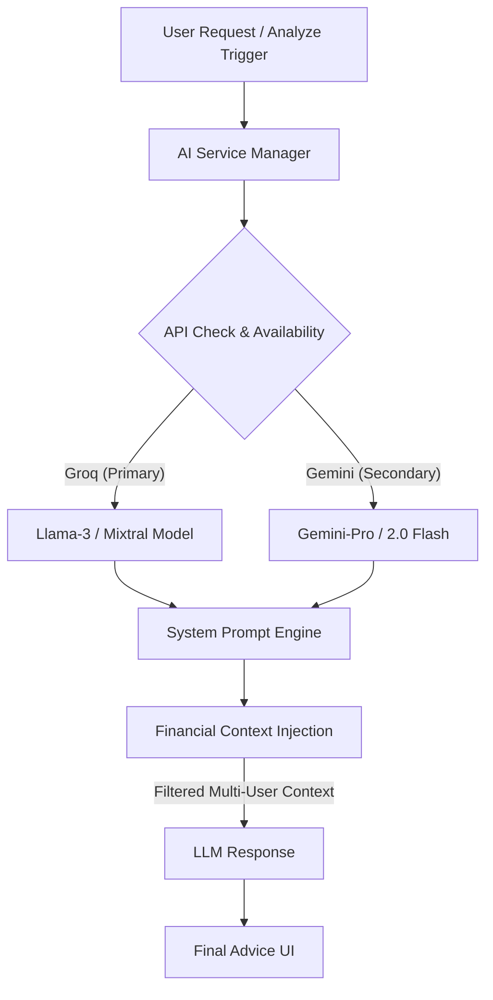

# 🤖 System Plan: Archen AI Financial Advisor
**Status: COMPLETED (Production Ready)**

Archen adalah asisten finansial yang tertanam dalam aplikasi, dirancang untuk menganalisis data transaksi user dan memberikan rekomendasi yang cerdas, hemat, dan personal.

---

## 🏗️ AI Service Architecture

---

## 🚀 Fitur Utama

### 1. Multi-LLM Engine & Fallback Logic
Sistem tidak bergantung pada satu provider saja demi menjaga stabilitas:
- **Groq API**: Digunakan sebagai mesin utama karena latensi yang sangat rendah.
- **Gemini 2.0 API**: Digunakan sebagai mesin cadangan (fallback) dan untuk analisis data yang lebih kompleks/luas.
- **Auto-Switch**: Jika Groq menemui error atau limit, sistem otomatis berpindah ke Gemini tanpa interupsi bagi user.

### 2. Contextual Financial Prompts
Sistem tidak mengirim data mentah melainkan menyusun konteks yang aman:
- **Data Filtering**: Hanya kategori, nominal, dan frekuensi yang dikirim (bukan data pribadi sensitif).
- **Tone & Style**: Archen diinstruksikan untuk bersuara profesional namun tetap ramah (seperti penasihat keuangan pribadi).

### 3. API Resilience (Timeout Safeguard)
Mencegah UI aplikasi "ding" atau macet jika API eksternal sedang lambat:
- **30s Hard Timeout**: Jika API tidak memberikan respon dalam 30 detik, sistem menampilkan UI ramah pengguna untuk mencoba lagi nanti.

---

## 🛠️ Komponen Teknis
| Komponen | Deskripsi |
| :--- | :--- |
| `AIService.dart` | Singleton manager yang menangani request ke Groq & Gemini. |
| `ArchenAnalyticScreen.dart` | UI Chat / Panel Analisis yang menampilkan hasil AI. |
| `FirestoreService.dart` | Melakukan agregasi saldo/pengeluaran sebelum dikirim ke AI. |

---

## 🎯 Target Pengalaman User
- **Instan**: User mendapatkan analisis instan setiap kali menekan tombol analisis saldo.
- **Smart**: Rekomendasi yang diberikan spesifik berdasarkan kebiasaan belanja user.
- **Reliable**: Sistem tetap berjalan meskipun salah satu provider AI (Groq/Gemini) sedang down.
