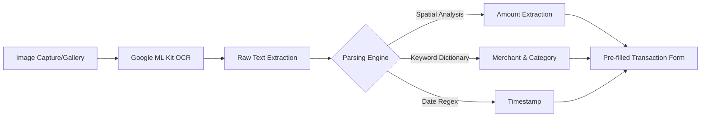

# 📸 System Plan: AI Receipt Scanner & OCR
**Status: COMPLETED (Production Ready)**

Fitur ini memungkinkan user untuk mencatat transaksi hanya dengan memotret struk belanja. Sistem secara otomatis mengekstrak Nama Merchant, Total Belanja, Tanggal, dan Kategori menggunakan kombinasi On-Device OCR dan Logika Spasial.

---

## 🧠 Alur Pengolahan Data

---

## 🚀 Fitur Unggulan

### 1. Spatial Amount Detection (SAD)
Berbeda dengan OCR biasa yang hanya mencari baris teks, sistem ini menggunakan **Spatial Analysis**:
- **Keyword Priority**: Mencari label seperti `TOTAL`, `GRAND TOTAL`, atau `JUMLAH` dengan bobot prioritas.
- **Y-Axis Alignment**: Mencari angka yang sejajar secara horizontal dengan keyword tersebut.
- **Bottom-Heavy Fallback**: Jika tidak ada keyword, sistem akan mencari angka terbesar di 50% bagian bawah struk (lokasi umum total belanja).

### 2. Auto-Categorization
Menggunakan kamus internal untuk memetakan nama merchant ke kategori aplikasi:
- `ALFAMART / INDOMARET` -> **Belanja**
- `PERTAMINA / SHELL` -> **Transportasi**
- `STARBUCKS / MCD` -> **Makanan**

### 3. Smart Date Extraction
Mampu mengenali berbagai format tanggal (`DD/MM/YY`, `DD-MM-YYYY`) dan melakukan normalisasi tahun untuk menghindari kesalahan input.

---

## 🛠️ Komponen Teknis
| Komponen | Library / Fungsi |
| :--- | :--- |
| **Provider** | `google_mlkit_text_recognition` |
| **Permission** | `Permission.camera` & `Permission.storage` |
| **Logic** | `ReceiptOCRService.dart` |
| **UI** | `ReceiptScannerButton` (Floating trigger) |

---

## 📝 Batasan & Limitasi
1. **Bahasa**: Dioptimalkan untuk struk dengan karakter Latin (Indonesia/English).
2. **Kualitas Gambar**: Memerlukan pencahayaan yang cukup dan teks yang tidak terlipat untuk akurasi maksimal.
3. **Mata Uang**: Default mendeteksi angka desimal dan ribuan (IDR).
