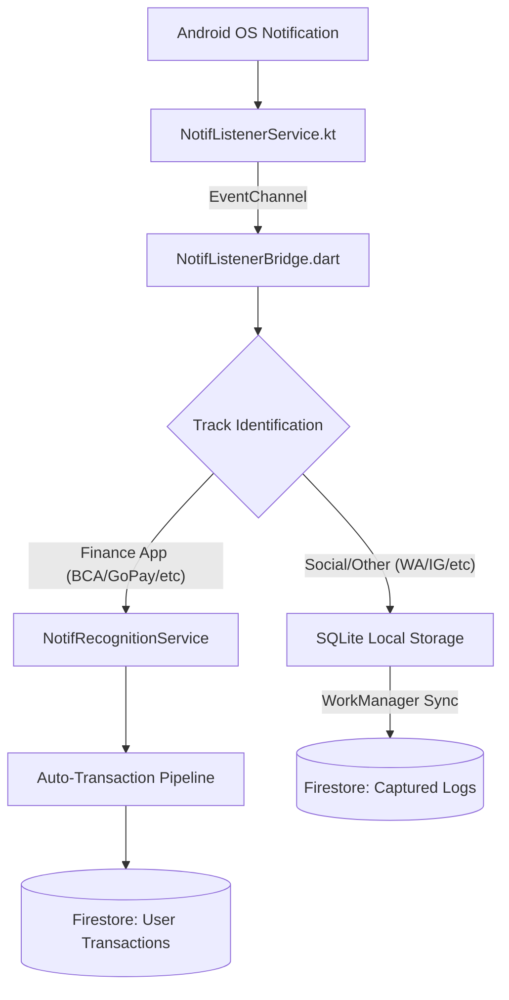

# 📱 System Plan: Auto-Magic Sync & Notification Listener
**Status: COMPLETED (Production Ready)**

Sistem ini adalah infrastruktur hybrid (Android Native + Flutter) yang memungkinkan aplikasi untuk "mendengar" notifikasi dari aplikasi lain secara pasif, memproses data keuangan secara otomatis, dan menyediakan log monitoring untuk administrator.

---

## 🏗️ Arsitektur Hybrid
Sistem menggunakan pola **EventChannel** untuk streaming data real-time dan **MethodChannel** untuk kontrol status.

---

## 🚀 Fitur Utama & Logika Bisnis

### 1. Dual-Track Processing (Privasi & Efisiensi)
Sistem memisahkan data berdasarkan sumber aplikasinya:
- **Track A (Financial Automation)**: 
    - Mendeteksi Apps: BCA Mobile, BRImo, Livin', BNI, GoPay, ShopeePay, OVO, DANA.
    - Logika: Ekstrak nominal via Regex -> Tentukan Income/Expense -> Masukkan ke dompet **"Financial Apps"**.
    - **Privasi**: Data ini langsung diproses ke akun user dan **tidak dikirim** ke log monitoring admin.
- **Track B (Social Monitoring)**:
    - Mendeteksi Apps: WhatsApp, Instagram, Telegram, dll.
    - Logika: Simpan teks mentah ke SQLite -> Sinkronisasi berkala ke "Eagle Eye Logs" via WorkManager.

### 2. Auto-Wallet Creation
Sistem akan otomatis membuat dompet baru bernama **"Financial Apps"** (Tipe: Personal) saat pertama kali transaksi otomatis terdeteksi. User tidak perlu melakukan setup manual.

### 3. Glassmorphism Permission UI
- **Floating Card**: UI transparan dengan Backdrop Blur di HomeScreen.
- **Experimental Badge**: Penanda status beta fitur untuk mengelola ekspektasi user.
- **Smart Dismiss**: Sistem mengingat pilihan "Nanti Saja" user melalui SharedPreferences.

---

## 🛠️ Komponen Teknis
| Komponen | Deskripsi |
| :--- | :--- |
| `NotifListenerService.kt` | Service level-Native yang berjalan di background untuk menangkap `StatusBarNotification`. |
| `NotifListenerBridge.dart` | Jembatan komunikasi data antara Kotlin dan Dart. |
| `NotifRecognitionService.dart` | Mesin parser berbasis Regex untuk mengekstrak nominal dan kategori transaksi. |
| `NotifLocalDbService.dart` | Database SQLite lokal untuk antrian sinkronisasi log sosial. |
| `NotifSyncService.dart` | Manager WorkManager yang mengatur pengiriman batch log ke Firestore setiap interval tertentu. |

---

## 🔐 Keamanan & Kontrol
- **SuperAdmin Control**: Fitur dapat dinonaktifkan secara global melalui Firestore (`app_config/notification_listener`).
- **Permission Guard**: Pengecekan status izin sistem Android sebelum mengaktifkan listener.
- **Reset Logic**: User dapat menampilkan kembali banner izin melalui menu Report jika sebelumnya telah di-dismiss.
